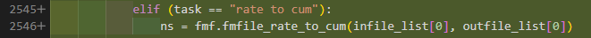

# In the beginning
There was nothing

Been working on the project for X months and recently v1 was released and thought it was fitting to do a retrospective

There is a lot more to a project than the git history, but for the sake of time and simplicity, I am going to focus on the code.

And mostly not on features of fluidmagic, since that might not be super interesting

An overview of what I've learned working on a python project for Equinor for quite a long time

Maybe some useful information for you

Though this is my first major project, so a lot of it will probably be banal(?) for most people here.

---
layout: timeline
currentDate: '2021-11-05'
---

<CommitInfo 
  title="Add files via upload"
  author="kuleb"
  message=""
  changes=" files via upload
20 files changed, 90263 insertions(+)"
  :files="['code/Deleteme.py','code/OLD_fm_file_handle - Copy.py','code/banner.py','code/debug.txt','code/eclread.py','code/eos.py','code/fluid_magic.py','code/fm_blackoil.py','code/fm_boc_converter.py','code/fm_calculator.py','code/fm_converters.py','code/fm_e300_data.py','code/fm_file_handle.py','code/fm_fluid_gradients.py','code/fm_gamma_plus.py','code/fm_numerics.py','code/fm_postecl.py','code/fm_process.py','code/fm_process_converters.py','code/pvt.py']"
  date="2021-11-05"
/>

---
layout: timeline
currentDate: '2021-11-05'
---

## `code/fluid_magic.py`


```python
"""
Main program for FluidMagic project

Fluid Magic is a program for consistent conversioin of fluids 
to various formats

Author : Knut Uleberg, kuleb@statoil.com
Date   : 25.07.17
 
Updates:
"""

# Special modules related to the FluidMagic project
import banner
import eos
import pvt
import fm_boc_converter as boc
import fm_process_converters as procnv

import fm_blackoil as blackoil
import fm_file_handle as fmf
import fm_process as pro
import fm_converters as cnv
import fm_gamma_plus as gamma
import fm_e300_data as e300_data
import fm_fluid_gradients as gradient
```

---
layout: timeline
currentDate: '2021-11-05'
---
## `code/fluid_magic.py`


### 25.07.17 ➡ 2021-11-05
The project had grown gradually

It was now 2500++ lines of elif statements

For Knut, it became a project to rewrite it, during the most dull/horrifying months of corona.  

But he's not a developer and I think this was the first time he had used git (double check?)

---
layout: timeline
currentDate: '2022-02-09'
---

<CommitInfo 
  title=":tada: Initial commit newest version of code (#9)"
  author="Aleksander Mats Karlsson"
  message="Source code written by @kuleb <kuleb@equinor.com>"
  changes="18 files changed, 18378 insertions(+)"
  :files="['src/banner.py','src/eclread.py','src/eos.py','src/fluid_magic.py','src/fm_blackoil.py','src/fm_boc_converter.py','src/fm_calculator.py','src/fm_converters.py','src/fm_e300_data.py','src/fm_file_handle.py','src/fm_fluid_gradients.py','src/fm_gamma_plus.py','src/fm_multi_phase_meters.py','src/fm_numerics.py','src/fm_postecl.py','src/fm_process.py','src/fm_process_converters.py','src/pvt.py']"
  date="2022-02-09"
/>

---
layout: timeline
currentDate: '2022-02-09'
---

Bouvet was hired to refactor and continue development on the project.

With team Seid located in Trondheim

---
layout: timeline
currentDate: '2022-02-09'
---

<CommitInfo 
  title=":see_no_evil: Add gitignore (#10)"
  author="Aleksander Mats Karlsson"
  :message="'Add gitignore generated from https://www.toptal.com/developers/gitignore with arguments:\n\n- python\n- visualstudiocode\n- pycharm\n- vim\n- macos\n- windows\n- linux'"
  changes="1 file changed, 378 insertions(+)"
  :files="['.gitignore']"
  date="2022-02-09"
/>

---
layout: timeline
currentDate: '2022-02-09'
---

<CommitInfo 
  title="Add requirements for pip (#12)"
  author="Aleksander Mats Karlsson"
  :message="'➕ Add requirements.txt\n\nCo-authored-by: André Helland [ashel@equinor.com]'"
  changes="1 file changed, 18 insertions(+)"
  :files="['requirements.txt']"
  date="2022-02-09"
/>

---
layout: timeline
currentDate: '2022-02-09'
---
```
cycler==0.11.0
et-xmlfile==1.1.0
fonttools==4.29.1
kiwisolver==1.3.2
matplotlib==3.5.1
numpy==1.22.1
openpyxl==3.0.9
packaging==21.3
pandas==1.4.0
Pillow==9.0.0
pyparsing==3.0.7
pytest==7.0.0
python-dateutil==2.8.2
pytz==2021.3
pywin32==303
scipy==1.7.3
six==1.16.0
xlwings==0.26.1
```
Inital deps for the project.

Most noteworthy being, numpy, scipy and pandas


---
layout: timeline
currentDate: '2022-02-10'
---

<CommitInfo 
  title="Set up github actions CI (#13)"
  author="André Strømsnes Helland"
  :message="''"
  changes="2 files changed, 33 insertions(+)"
  :files="['.github/workflows/auto_build_test.yml','tests/temp_test.py']"
  date="2022-02-10"
/>

---
layout: timeline
currentDate: '2022-02-10'
---
```
name: Push test

on: [push]

jobs:
  Windows:

    runs-on: windows-2019

    steps:
      - uses: actions/checkout@v2
      - name: Set up Python ${{ matrix.python-version }}
        uses: actions/setup-python@v2
        with:
          python-version: 3.9
      - name: Install dependencies

        shell: pwsh
        run: |
          python -m venv venv
          .\venv\Scripts\Activate.ps1
          python -m pip install --upgrade pip
          pip install -r .\requirements.txt

      - name: Test with pytest
        run: |
          .\venv\Scripts\Activate.ps1
          pytest .\tests
```


---
layout: timeline
currentDate: '2022-02-15'
---

<CommitInfo 
  title="Add a PR template (#25)"
  author="Arvid Gräns"
  :message="''"
  changes="1 file changed, 13 insertions(+)"
  :files="['.github/pull_request_template.md']"
  date="2022-02-15"
/>

---
layout: timeline
currentDate: '2022-02-15'
---

```md
# Description

Please include a summary of the change and which issue is fixed.

Close #(issue)

# Checklist:
Before submitting this PR, please make sure:

- [ ] Your code builds clean without any errors or warnings
- [ ] I have added tests that prove my fix is effective or that my feature works
- [ ] New and existing tests pass with my changes
- [ ] I have made corresponding changes to the documentation
```

---
layout: timeline
currentDate: '2022-02-21'
---

<CommitInfo 
  title="Create a README for the project (#23)"
  author="Arvid Gräns"
  :message="'* Create README.md'"
  changes="1 file changed, 64 insertions(+)"
  :files="['README.md']"
  date="2022-02-21"
/>

---
layout: timeline
currentDate: '2022-02-21'
---
# FluidMagic


[](https://github.com/psf/black)

[](https://github.com/pre-commit/pre-commit)

[](https://www.python.org/downloads/release/python-390/)

FluidMagic™ is a software tool for consistent conversion of fluid streams, it includes: 

- Conversion from volumes to molar compositions 

- Conversions from molar compositions to volumes 

- Conversions between different EOS descriptions (moles-to-moles) 

- Conversion from moles to mass and from mass to volumes

Typical application areas include:
- Conversion of Eclipse-100 volumetric rates to compositional streams and sales products.
- Production allocation by conversion of test separator measurements to corresponding molar streams and surface process rates. 

## Documentation
Documentation and manual for FluidMagic is found in [this document](https://statoilsrm-my.sharepoint.com/:w:/r/personal/kuleb_equinor_com/_layouts/15/Doc.aspx?sourcedoc=%7BA4EAF06A-3147-4146-97D3-9C96269BA5D8%7D&file=FluidMagic_Manual.docx&action=default&mobileredirect=true&cid=2b250732-ef16-4ee3-933e-a6e5a936e98e). For the moment, you may need to ask Knut Uleberg (kuleb@equinor.com) for permission to view this document.

## Prerequisites
In order to run FluidMagic you need to have [Python](https://www.python.org/) installed.

Also, you need to have cloned [this](https://github.com/equinor/FluidMagic) repostory to have the code on your machine locally.

## Running
Run it locally by:<br />
(1) Open a DOS console.<br /> 
(2) Activate your Python environment by typing python 
```bash
python
```

```
(3) Run
```bash 
python <path to fluid_magic.py> <path and name of input datafile>
```
```
## Development
### Pre-commit

#### 1) Install pre-commit
Create a [virtualenv](https://pytr.readthedocs.io/tr/latest/tutorial/venv.html) (recommended)
```bash
python3 -m venv .venv
source .venv/bin/activate # unix
.venv/Scripts/activate    # windows
```

```

```bash
pip install -r requirements.txt
```

```
Alternative pre-commit installations can be found [here](https://pre-commit.com/#install).
#### 2) Run pre-commit manually
```bash
pre-commit run -a
```


---
layout: timeline
currentDate: '2022-03-07'
---

<CommitInfo 
  title="Integration test* (#46)"
  author="André Strømsnes Helland"
  :message="'Test uses *confidential* data.\nFiles required to run the test must be placed in the integration folder for the test to run successfully.\nclose #16'"
  changes="2 files changed, 57 insertions(+)"
  :files="['tests/files/integration_expected.json','tests/integration_test_skip.py']"
  date="2022-03-07"
/>

---
layout: timeline
currentDate: '2022-03-07'
---

## First test added to the project
```
{
  "pre_test_expected" : ["b255c3af708085a9ef19d73c72b68b8200f3752e78a4ad771cc3cb076a65a4d2", ...
  "post_test_expected" : ["b255c3af708085a9ef19d73c72b68b8200f3752e78a4ad771cc3cb076a65a4d2", ...
}
```

```python
def hash_files(folder):
    # NOTE Files in integration folder must be replaced each time the test is run to get a pass.
    out = []
    for root, dirs, files in os.walk(folder):
        for file in files:
            path = os.path.join(root, file)
            sha = sha256()
            with open(path, "rb") as f:
                for chunk in iter(lambda: f.read(4096), b""):
                    sha.update(chunk)
                out.append(sha.hexdigest())
    return out


def test_file_hash():
    test_folder = ROOT_DIR / "tests" / "files" / "integration"
    expected_path = ROOT_DIR / "tests" / "files" / "integration_expected.json"

    with open(expected_path, "r") as f:
        expected = json.loads(f.read())

    pre_test_hash = hash_files(test_folder)
    assert pre_test_hash == expected["pre_test_expected"]

    case_file = test_folder / "ECL_DEMO.DAT"
    temp = sys.argv[1]  # Horrible workaround for broken check at line 2735 in fluid_magic.py
    sys.argv[1] = str(case_file)
    fluid_magic.main()
    sys.argv[1] = temp

    post_test_hash = hash_files(test_folder)

    # 8th element/file is non-deterministic and needs to be skipped
    post_test_hash[8] = expected["post_test_expected"][8]

    assert post_test_hash == expected["post_test_expected"]
```


---
layout: timeline
currentDate: '2022-03-08'
---

<CommitInfo 
  title=":wrench: :art: Setup Github Actions and pre-commit (#30)"
  author="André Strømsnes Helland"
  :message="'* add black check\n\n* :wrench:Add configuration for pre-commit\n\npre-commit is configured with several hooks to ensure a standard for\ndevelopment practices:\n- several standard pre-commit hooks\n- black\n- flake8\n- isort\n\n:arrow_up: Update requirements with pre-commit, isort, black,\nand flake8\n\n* Added flake8 and isort\n\n* :construction: WIP on fix for flake8\n\n* Add config for black, flake8, isort\n\n* :wrench: Make flake8 less strict\n\nFlake8 reports a lot of errors/warnings that would be a large\nundertaking to fix in the current state of the code. As a result\nthe pre-commit hook would not allow you to commit code without fixing\nall the warnings or passing \`--no-verify\` each time you commit.\n\nSince the plan is to refactor the codebase it is probably more sensible\nto reintroduce some warnings as the project matures/is refactored. That\nway we can refactor the code without fighting with flake8 on earlier\ncode in the same file, but still get the most essential warnings.\n\n* :wrench:Add configuration for pre-commit\n\npre-commit is configured with several hooks to ensure a standard for\ndevelopment practices:\n- several standard pre-commit hooks\n- black\n- flake8\n- isort\n\n:arrow_up: Update requirements with pre-commit, isort, black,\nand flake8\n\n* Sort all imports\n\n* Run black on all files\n\n* Add test to verify pytest is configured\n\n* :see_no_evil: Ignore \`.vscode\` folder\n\n* Run standard pre-commit hooks\n\nExcluding flake8 hook, needs its own PR to resolve all the issues.\n\nHooks run, including, but not limited to:\n- check for debug-statements\n- fix end of file, all files end in a newline, nothing else\n- resolve mixed line ending, to the most commonly used in that file\n- trim trailing whitespace\n- check docstrings appear in the correct positions\n- sort entries in requirements.txt\n\n* add black check\n\n* Added flake8 and isort\n\n* using one yml file\n\n* Update build.yml\n\n* Update build.yml\n\n* Remove flake8 from pre-commit for now\n\nThere are larger refactors needed in code before it is nessecary to\nhandle flake8 warnings\n\n* Added flake8 and isort\n\n* using one yml file\n\n* Run black on all files\n\n- Run black\n- Add some FIXMEs\n- Some small changes to code e.g. from \`if not foo in bar\` to\n\`if foo not in bar\`\n\n* :rotating_light: Small temporary fixes to resolve flake8 warnings\n\n- Fixed some minor errors, e.g. variable accessed before assignement\n- Ignored a warning, added a FIXME as well as an issue\n\n* :see_no_evil: Remove trailing whitespace\n\n* Add proper main to fluid_magic.py and fixed pre-commit issues.\n\n* Add proper main to fluid_magic.py.\n\n* Fix: divide by zero error, and main quotes.\n\n* Update .github/workflows/build.yml\n\nCo-authored-by: Aleksander Mats Karlsson [AMKA@equinor.com]\n\n* Update tests/temp_test.py\n\nCo-authored-by: Aleksander Mats Karlsson [AMKA@equinor.com]\n\nCo-authored-by: Aleksander Mats Karlsson [amka@equinor.com]'"
  changes="27 files changed, 9142 insertions(+), 7630 deletions(-)"
  :files="['.github/workflows/auto_build_test.yml','.github/workflows/build.yml','.gitignore','.pre-commit-config.yaml','README.md','requirements.txt','src/banner.py','src/eclread.py','src/eos.py','src/fluid_magic.py','src/fm_blackoil.py','src/fm_boc_converter.py','src/fm_calculator.py','src/fm_converters.py','src/fm_e300_data.py','src/fm_file_handle.py','src/fm_fluid_gradients.py','src/fm_gamma_plus.py','src/fm_multi_phase_meters.py','src/fm_numerics.py','src/fm_postecl.py','src/fm_process.py','src/fm_process_converters.py','src/pvt.py','tests/files/integration_expected.json','tests/integration_test_skip.py','tests/temp_test.py']"
  date="2022-03-08"
/>

---
layout: timeline
currentDate: '2022-03-08'
---

## `.pre-commit-config.yaml (d8d33c3)`

```
repos:
-   repo: https://github.com/pre-commit/pre-commit-hooks
    rev: v4.1.0
    hooks:
    -   id: no-commit-to-branch  # Do not allow commits to master/main branch
    -   id: check-json  # Attempts to load all json files to verify syntax
    #-   id: pretty-format-json  # Check all JSON files are sorted and indented (2)
    -   id: check-yaml  # Attempts to load all yaml files to verify syntax
    -   id: debug-statements  # Looks for debugger imports and `breakepoint()`
    -   id: end-of-file-fixer  # Ensure ends with newline
    -   id: fix-encoding-pragma
        args: [--remove]  # Remove the coding pragma (useful for py3-only codebase)
    -   id: mixed-line-ending  # Replaces mixed line ending to the most common
    -   id: trailing-whitespace  # Trim trailing whitespace
    -   id: detect-private-key  # Checks for private keys
    -   id: check-docstring-first  # Look for code above docstring
    -   id: check-merge-conflict  # Check for merge conflict strings
    -   id: name-tests-test  # Check files in tests/ end with `_test.py`
    -   id: requirements-txt-fixer  # Sort entries in requirements.txt,
                                    # and remove incorrect entry for pkg-resources=0.0.0
    -   id: check-added-large-files  # Prevent giant files from being committed
        args: ['--maxkb=200']

-   repo: https://github.com/pycqa/isort
    rev: 5.10.1
    hooks:
    -   id: isort
        args: ["--profile", "black"]  # Ensure compatibility with black
        name: isort (python)

-   repo: https://github.com/ambv/black
    rev: 22.1.0
    hooks:
    -   id: black
        args: # arguments to configure black
        -   --line-length=88
        -   --include='\.pyi?$'

        # these folders wont be formatted by black
        -   --exclude="""\.git |
            \.__pycache__|
            \.hg|
            \.mypy_cache|
            \.tox|
            \.venv|
            _build|
            buck-out|
            build|
            dist"""

-   repo: https://gitlab.com/pycqa/flake8
    rev: 3.9.2
    hooks:
    -   id: flake8
        name: flake8-bugbear
        additional_dependencies: [flake8-bugbear==22.1.11]
        args: # arguments to configure flake8
            # making isort line length compatible with black
            -   "--max-line-length=88"
            # -   "--max-complexity=18"
            # -   "--select=C,E,F,W,T4,B9"
            -   "--select=E9,F63,F7,F82"

            # these are errors that will be ignored by flake8
            # check out their meaning here
            # https://flake8.pycqa.org/en/latest/user/error-codes.html
            -   "--ignore=E203, E266, W503, W504, E501"
```

---
layout: timeline
currentDate: '2022-04-01'
---

<CommitInfo 
  title="Case reader (#70)"
  author="André Strømsnes Helland"
  :message="'* WIP: Case reader\n\n* Case reader\n\n* Apply suggestions from code review\n\nCo-authored-by: Aleksander Mats Karlsson [AMKA@equinor.com]\n\n* misc fix\n\nCo-authored-by: Aleksander Mats Karlsson [AMKA@equinor.com]'"
  changes="9 files changed, 569 insertions(+), 42 deletions(-)"
  :files="['.pre-commit-config.yaml','requirements.txt','src/readers/base_reader.py','src/readers/case_reader.py','src/readers/ecl_reader.py','src/readers/exceptions.py','tests/file_readers_test.py','tests/files/readers/caseReaderTestData.json','tests/files/readers/test_case.DAT']"
  date="2022-04-01"
/>

---
layout: timeline
currentDate: '2022-04-01'
---
## `src/readers/case_reader.py (6457898)`

```python
import re
from dataclasses import dataclass
from pathlib import Path
from typing import Any, Union

from readers.base_reader import BaseReader
from readers.exceptions import CaseReaderException


@dataclass
class ReaderConfig:
    comment_delimiter: str = "#"
    remove_inline: bool = True
    trim_whitespace: bool = True
    end_of_record: str = "end"


class CaseReader(BaseReader):
    """Class for reading case file.

    Keywords in file are made into dictionary keys and the associated data will be the value in the key value pair.
    If reading or parsing fails CaseReaderException will be raised.
```

---
layout: timeline
currentDate: '2022-04-01'
---

## Case file in Magic Syntax

```
eos:
    name: eos22
    infile: eos22.e300
end

process:
    name: my_process
    table:
        # Name      Type      Temp   Pres   GP-table  Voil   Vgas   Oil_dest   Gas_dest
        SEP1        FLASH     65      21     *        *     *       SEP2       GASTANK
        SEP2        FLASH     80      18     *        *     *       SEP3       GASTANK
        SEP3        FLASH     47      6      *        *     *       SEP4       GASTANK
        SEP4        FLASH     40      1.5    *        *     *       SEP5       GASTANK
        SEP5        FLASH     15      1.013  *        *     *       OILTANK    GASTANK
        OILTANK     OILTANK   15.0    1.013
        GASTANK     GASTANK   15.0    1.013
    end
end

streamfile:
    name: my_stream
    infile: volume.txt
end

convert volume to moles:
    stream: my_stream
    eos: eos22
    process: my_process
    bocfile: bo_to_moles.boc
    recombine: yes
    outfile: moles.txt
end
```

---
layout: timeline
currentDate: '2022-09-07'
---

<CommitInfo 
  title="Add documentation, update README and main.py  (#179)"
  author="Ingebrigt Nygård"
  :message="'* EOS was not properly imported when run from command line, moved to src\n\n* Make main runnable from command line with case_reader\n\n* :recycle: Rename change fluid_magic.py to fluid_magic_legacy.py\n\n* Update documentation\n\n* Update README.md\n\n\nCo-authored-by: André Strømsnes Helland [andrehelland99@gmail.com]\nCo-authored-by: Arvid Gräns [79848215+ArGr1@users.noreply.github.com]'"
  changes="11 files changed, 3778 insertions(+), 2942 deletions(-)"
  :files="['README.md','docs/DOCUMENTATION.md','docs/surface_process.png','docs/typical_workflow.png','eos/eos.py','src/eos/eos.py','src/fluid_magic.py','src/fluid_magic_legacy.py','src/main.py','src/parsers/case_parser.py','tests/files/proper_case_files/formatted_case_file.dat','tests/integration_test.py']"
  date="2022-09-07"
/>
---
layout: timeline
currentDate: '2022-09-07'
---
> 5 months later
# `docs/DOCUMENTATION.md (11b3f73)`
## Case file format

Case files are files that instruct FluidMagic on what data to use and what operations to execute. Other data might be:
- Fluid files, containing fluid streams data
- Eclipse result files, for black-oil conversions
- Fluid PVT input, EOS description or black-oil tables

### General case file format
The general syntax in the FluidMagic case file is formatted as follows;
```
# This is a comment line

Keyword:
 Infile: input_fluid_file_path
 Subkeyword: argument
 Subkeyword: argument
 Subkeyword:
    Subsubkeyword: argument
    Subsubkeyword: argument
 End
 Outfile: output_fluid_file_path
End
```

Any line starting with the character “#” is treated as a line comment. Keywords are not case sensitive. Keywords and arguments are separated by colon separator ":".

An execution instruction in FluidMagic typically starts with a keyword followed by several sub-keywords and associated arguments. Typically, the minimum number of sub-keywords would be “Infile” and “Outfile”, specifying the input and output file names respectively.

---
layout: timeline
currentDate: '2022-10-05'
---

<CommitInfo 
  title="README: Add more elaborate description (#227)"
  author="Magnus Kvittingen Fresvik"
  :message="`* README: Add more elaborate description on various tools used in the repository e.g. black and pre-commit and added some VSC specific tips`"
  changes="1 file changed, 93 insertions(+), 5 deletions(-)"
  :files="['README.md']"
  date="2022-10-05"
/>


---
layout: timeline
currentDate: '2022-10-05'
---
## My first commit
Ironically not a very elaborate description.

Tools and tips I was taught during onboarding.

A good way to start working on a new project. (Though ideally the docs are up to date and enough to get you up and running)

Not really sure how I ended up working with a dev team in Trondheim. But PO works in Forus, so that's part of the reason

---
layout: timeline
currentDate: '2022-10-05'
---
### Pre-commit

Before committing and pushing your code, stage your changes and run: `pre-commit`

>Git hook scripts are useful for identifying simple issues before submission to code review. Run hooks on every commit to automatically point out issues in code such as missing semicolons, trailing whitespace, and debug statements. By pointing these issues out before code review, this allows a code reviewer to focus on the architecture of a change while not wasting time with trivial style nitpicks.
Black will style your code automatically to match the Black code style, and Flake8 will check your code for style, syntax, and logical errors. Remember to add the changes made by the scripts to your commit.

*Later changed to run automatically before commits.* 
---
layout: timeline
currentDate: '2022-10-05'
---
### Black and flake8

This project uses [black](https://pypi.org/project/black/) and [flake8](https://pypi.org/project/flake8/) for code formatting and linting. \
It deviates from the default black config by setting the max line length to 120 characters. \
If using VSCode, add the following to your `settings.json` file to use the same settings as the project:

```json
"python.formatting.provider": "black",
"python.linting.flake8Enabled": true,
"python.linting.flake8Args": [
    "--max-line-length=120"
],
"python.formatting.blackArgs": [
    "--line-length=120 --include='\\.pyi?$'"
]
```
---
layout: timeline
currentDate: '2022-10-05'
---
A helpful visual aid is to set rulers in your editor to 90/120 characters. \
Code should not exceed 90 characters, and lines of strings should not exceed 120 characters. \
Add this to you `settings.json` to set rulers in VSCode:

```json
"editor.rulers": [
        90,
        120,
    ],
    "workbench.colorCustomizations": {
        "editorRuler.foreground": "#33779944"
    },
```

Another helpful config is to turn on format-on-save, to make black format your code on save. \
For VSCode, add this to your `settings.json`:

```json
"editor.formatOnSave": true,
```

---
layout: timeline
currentDate: '2022-10-06'
---

<CommitInfo 
  title="177 Multiple streamfiles in parser (#196)"
  author="Magnus Kvittingen Fresvik"
  :message="'* Allow loading of multiple infiles e.g. xlsx and txt, and specify sheetname with > character\n\n* Update Infile in documentation\n\n* ♻️Recursively remove quotes and keep original when specified.\n\n* Add test for parse_infiles\n\n* Add function to check that keywords are on the expected format\n\nCo-authored-by: Ingebrigt Nygård [inny@equinor.com]\nCo-authored-by: André Strømsnes Helland [andrehelland99@gmail.com]'"
  changes="16 files changed, 235 insertions(+), 109 deletions(-)"
  :files="['README.md','docs/DOCUMENTATION.md','src/parsers/case_parser.py','src/parsers/eos_parser_compatible.py','src/readers/case_reader.py','src/readers/stream_file_reader.py','src/utils/dataframe_tools.py','src/utils/parse_tools.py','src/writers/stream_file_writer.py','tests/case_file_reader_test.py','tests/case_parser_test.py','tests/files/proper_case_files/formatted_case_file.dat','tests/files/readers/caseReaderTestData.json','tests/integration_test.py','tests/parse_tools_test.py','tests/stream_file_reader_test.py']"
  date="2022-10-06"
/>

---
layout: timeline
currentDate: '2022-10-06'
---
>The input/output fluid stream files typically contain fluid steams in the form of either volumetric or compositional rates, together with associated properties such as well-name, date, time, pressure, temperature, etc.
```
# Example of multifile syntax
streamfile:
    infile: 
        Streamfile.xlsx > SomeSheet 
        Streamfile2.xlsx
    end
    outfile: output_test.txt
end
```


---
layout: timeline
currentDate: '2022-10-11'
---

<CommitInfo 
  title="Added a Table of Contents (#252)"
  author="Magnus Kvittingen Fresvik"
  :message="'* Added a table of contents to DOC.md\n\n* Changed some to h2'"
  changes="1 file changed, 37 insertions(+), 5 deletions(-)"
  :files="['docs/DOCUMENTATION.md']"
  date="2022-10-11"
/>
---
layout: timeline
currentDate: '2022-10-11'
---
## `docs/DOCUMENTATION.md (1bf0f30)`
> Some more changes to docs to make it more readable.
> At this point, documentation for the project was 1000 lines of slightly inconsistent markdown.
## **Table of Contents**
- [Case file format](#case-file-format)
  - [General case file format](#general-case-file-format)
  - [Message keyword](#message-keyword)
  - [Alias keyword](#alias-keyword)
  - [INCLUDE keyword](#include-keyword)
- [File format for input- and result FluidFiles](#file-format-for-input--and-result-fluidfiles)
- [Workflow description for black-oil conversions and well-test conversions](#workflow-description-for-black-oil-conversions-and-well-test-conversions)
- [Defining Equation of State fluid models (EOS keyword)](#defining-equation-of-state-fluid-models-eos-keyword)
  - [Reading EOS from an E300 include file](#reading-eos-from-an-e300-include-file)
  - [Specifying the EOS properties directly  (TODO: Not handled in the parser yet)](#specifying-the-eos-properties-directly--todo-not-handled-in-the-parser-yet)
  - [Generating a new default EOS characterization (TODO: Not handled in the parser yet)](#generating-a-new-default-eos-characterization-todo-not-handled-in-the-parser-yet)
- [Defining a surface process](#defining-a-surface-process)
  - [Defining process K-values table (KVALTABLE keyword)](#defining-process-k-values-table-kvaltable-keyword)
  - [Defining process oil component recovery factors table (RECTABLE keyword)](#defining-process-oil-component-recovery-factors-table-rectable-keyword)
  - [Defining the surface process layout (Process keyword)](#defining-the-surface-process-layout-process-keyword)
  - [Feed (TODO: missing description)](#feed-todo-missing-description)
- [Converting Eclipse-100 volumes to compositional streams and surface process sales products](#converting-eclipse-100-volumes-to-compositional-streams-and-surface-process-sales-products)
  - [Generating Black-Oil to Compositional Conversion Tables (Generate BOC Table keyword)](#generating-black-oil-to-compositional-conversion-tables-generate-boc-table-keyword)
- [Fluid stream file manipulations](#fluid-stream-file-manipulations)
  - [Sum (group) streams](#sum-group-streams)
  - [Output](#output)
  - [Rate_to_cum](#rate_to_cum)
  - [Cum_to_rate](#cum_to_rate)
  - [Timstep](#timstep)
  - [Calculate delta production over each time interval](#calculate-delta-production-over-each-time-interval)
  - [Filter](#filter)
  - [Combining different actions in FluidFile](#combining-different-actions-in-fluidfile)
- [Converters (TODO: Add all converters and include description)](#converters-todo-add-all-converters-and-include-description)
- [Conversion from ECL100 surface volume rates to molar compositional streams. (TODO: Outdated)](#conversion-from-ecl100-surface-volume-rates-to-molar-compositional-streams-todo-outdated)
- [Conversion from Molar streams to Surface Process Products (Sales products) (TODO: Outdated)](#conversion-from-molar-streams-to-surface-process-products-sales-products-todo-outdated)


---
layout: timeline
currentDate: '2022-10-12'
---

<CommitInfo 
  title="175 specify eos model properties in case file (#220)"
  author="Magnus Kvittingen Fresvik"
  :message="'* Initial solution to 175\n\n* Added a key check\n\n* Uncomment case_file\n\n* Blacked eos .py files\n\n* Added an nc check\n\n* Imported right logger\n\n* Added test for specify_eos_properties\n\n* reverted accidental newline\n\n* Used numpy to check if all bip values are equal\n\n* Changes from live review\n\n* Lazy solution for BIP syntax\n\n* Updated eos_parser_test\n\n* Added to properties\n\n* Changed to _to_matrix_\n\n* Move parsing of half matrix to parse_tools\n\n* Remove unnecessary assert when bip is 2d array\n\nCo-authored-by: Ingebrigt Nygård [inny@equinor.com]'"
  changes="8 files changed, 277 insertions(+), 75 deletions(-)"
  :files="['src/parsers/case_parser.py','src/parsers/ecl_parser.py','src/parsers/eos_parser.py','src/utils/parse_tools.py','tests/ecl_parser_test.py','tests/eos_parser_test.py','tests/files/proper_case_files/formatted_case_file.dat','tests/parse_tools_test.py']"
  date="2022-10-12"
/>

---
layout: timeline
currentDate: '2022-10-12'
---
>In order to do thermodynamic calculations, an Equation of State (EOS) Model must be specified.
```yaml
eos:
 Name: OSE9_PERA2003
 Type: PR78
 Properties:
    CNAMES   MW     TC      PC      AF          OMEGAA          OMEGAB      VS          SVS         LDEN
    CO2     44.0    304.2   73.8    0.23100     0.4572355       0.07780     -0.08200    -0.08200    500.0
    C2      30.1    305.4   48.8    0.09080     0.4572355       0.07780     -0.11300    -0.11300    450.0
    C3      44.1    369.8   42.5    0.14540     0.4572355       0.07780     -0.08600    -0.08600    500.6
    C4      58.1    420.3   37.5    0.18790     0.4551303       0.07774     -0.07183    -0.07183    577.6
    C5F2    92.0    538.0   31.9    0.27238     0.4443793       0.07705     -0.01421    -0.01482    717.0
    F3F4    154.5   662.7   24.5    0.41741     0.4381244       0.07645     0.01280     0.00638     818.7
    F5      293.1   815.3   15.1    0.75273     0.4572355       0.07780     0.06401     0.10668     888.0
    F6      588.6   981.0   9.3     1.29644     0.4572355       0.07780     0.07549     0.12582     956.9
 End
 BIP:
    0.10425
    0.13        0.00007
    0.125       0.00065     0
    0.11642     0.00068     0       0
    0.115       0.00686     0       0       0
    0.115       0.02225     0       0       0       0
    0.115       0.07792     0       0       0       0       0
    0.115       0.06248     0       0       0       0       0       0 
 End
End
```

---
layout: timeline
currentDate: '2022-11-09'
---

<CommitInfo 
  title="🧑‍💻Add *very_slow* pytest marker (#290)"
  author="André Strømsnes Helland"
  :message="'* Add *very_slow* pytest marker\n\n* Add slow mark\n\n* Update README.md'"
  changes="3 files changed, 10 insertions(+), 1 deletion(-)"
  :files="['README.md','pytest.ini','tests/integration_test.py']"
  date="2022-11-09"
/>

---
layout: timeline
currentDate: '2022-11-09'
---
>The joys of doing thermodynamic calculations in python 
## `README.md (2f59ee9)`
Some test are slow and very slow, theese can be skipped by using `-m "not slow"` and
`-m "not very_slow"`. Tests can be run in parallel using `-n auto` (auto can be
replaced by the amount of threads you want to use, auto use all).
Recommended settings/launch args:
```bash
pytest -n auto -m "not very_slow"
```

## `tests/integration_test.py (2f59ee9)`
```python
@pytest.mark.very_slow
def test_moles_to_moles(tmp_path):
    moles_to_moles_files = ROOT_DIR / "tests" / "files" / "moles_to_moles"
    case_file = "Moles_to_Moles_new_syntax.dat"

    clone_run_folder(moles_to_moles_files, tmp_path)

    os.chdir(tmp_path)
    reader = CaseReader()
    case_data = reader.read(case_file)
    parser = CaseParser()
    parser.parse_list(case_data)

    expected_files = ["converted_scn80_streams.txt", "lumped_EOS22_streams.txt"]
    check_expected_result(expected_files, tmp_path)
```

---
layout: timeline
currentDate: '2023-02-13'
---

<CommitInfo 
  title="Feature/314-plot-streamfile (#399)"
  author="Magnus Kvittingen Fresvik"
  :message="'Added plotting for multiIndex dfs using plotly'"
  changes="6 files changed, 285 insertions(+), 12 deletions(-)"
  :files="['docs/DOCUMENTATION.md','requirements.txt','src/case_runner.py','src/streamfile/stream_file.py','src/utils/plotter.py','tests/streamfile_test/stream_file_test.py']"
  date="2023-02-13"
/>


---
src: ./pages/plot.md
---

---
layout: timeline
currentDate: '2023-02-13'
---
## `src/utils/plotter.py (4db5b76)`
Made using plotly. Pretty straightforward to add functionality, no frontend knowledge required:
```python
def plot_streamfiles(dfs: list[pd.DataFrame], data: dict[str, Any]):
        {
            "buttons": [
                {
                    "args": [
                        {"yaxis": {"title": {"text": ytitle}, "type": "log"}},
                    ],
                    "label": "Y1 Log",
                    "method": "relayout",
                },
                {
                    "args": [
                        {"yaxis": {"title": {"text": ytitle}, "type": "linear"}},
                    ],
                    "label": "Y1 Linear",
                    "method": "relayout",
                },
            ],
            "direction": "up",
            "showactive": True,
            "type": "dropdown",
            "x": 1,
            "y": 0,
            "xanchor": "right",
            "yanchor": "bottom",
            "pad": {"r": -150, "b": 30},
        },...
```

---
layout: timeline
currentDate: '2023-03-06'
---

<CommitInfo 
  title="🔖👷Add version tags (#437)"
  author="André Strømsnes Helland"
  :message="'Add bump2version as version handling package.\nAdd CI run for checking versions are unique and incremented when merging to main.\nAdd CI run for releases.\nAdd setup.py.\n\n* Add version check CI\n\n* Add release CI\n\n* Bump version: 0.0.0 → 0.0.1\n'"
  changes="6 files changed, 128 insertions(+), 7 deletions(-)"
  :files="['.bumpversion.cfg','.github/workflows/create_new_release.yml','.github/workflows/verify_new_version.yml','.pre-commit-config.yaml','setup.py','src/fluid_magic.py']"
  date="2023-03-06"
/>
---
layout: timeline
currentDate: '2023-03-06'
---

> First attempt at making releases on github

> Did not work like we wanted, replaced by release please
## `.githubworkflows/create_new_release.yml (dea74da)`
```
name: Create new release

permissions:
  contents: write

on:
  push:
    branches:
      - main

jobs:
  create-release:
    runs-on: ubuntu-latest
    steps:
    - name: Checkout repository
      uses: actions/checkout@v2
    - name: Read current version from repository
      run: |
        echo "VERSION=$(cat .bumpversion.cfg | sed -n 's/^current_version = //p')" >> $GITHUB_ENV
    - name: Create new release
      uses: softprops/action-gh-release@v1
      with:
        name: "FluidMagic ${{ env.VERSION }}"
        tag_name: "v${{ env.VERSION }}"
        draft: false
        prerelease: false
        body: |
          The release includes the following changes:

          ${{ github.event.head_commit.message }}

          ---

          Install the release directly from GitHub using:
          ```
          pip install git+https://github.com/equinor/FluidMagic@v${{ env.VERSION }}
          ```
```

---
layout: timeline
currentDate: '2023-05-09'
---

<CommitInfo 
  title="Rename .dat to .magic file extension. (#496)"
  author="Arvid Gräns"
  :message="'* Rename .dat to .magic file extension.'"
  changes="20 files changed, 18 insertions(+), 18 deletions(-)"
  :files="[{'path': '.bumpversion.cfg', 'status': 'Modified'},{'path': 'README.md', 'status': 'Modified'},{'path': 'setup.py', 'status': 'Modified'},{'path': 'src/fluid_magic.py', 'status': 'Modified'},{'path': 'tests/integration_test.py', 'status': 'Modified'},{'path': 'tests/readers_test/case_file_reader_test.py', 'status': 'Modified'},{'path': 'tests/test_files/integration_expected/Forecast_Compositions.dat', 'status': 'Deleted'},{'path': 'tests/test_files/integration_expected/Forecast_Compositions.magic', 'status': 'Added'},{'path': 'tests/test_files/integration_test/Forecast_Compositions.dat', 'status': 'Deleted'},{'path': 'tests/test_files/integration_test/Forecast_Compositions.magic', 'status': 'Added'},{'path': 'tests/test_files/integration_test/eos_temp_case_file.dat', 'status': 'Deleted'},{'path': 'tests/test_files/integration_test/eos_temp_case_file.magic', 'status': 'Added'},{'path': 'tests/test_files/integration_test/formatted_case_file.dat', 'status': 'Deleted'},{'path': 'tests/test_files/integration_test/formatted_case_file.magic', 'status': 'Added'},{'path': 'tests/test_files/moles_to_moles/Moles_to_Moles.dat', 'status': 'Deleted'},{'path': 'tests/test_files/moles_to_moles/Moles_to_Moles.magic', 'status': 'Added'},{'path': 'tests/test_files/moles_to_moles/Moles_to_Moles_new_syntax.dat', 'status': 'Deleted'},{'path': 'tests/test_files/moles_to_moles/Moles_to_Moles_new_syntax.magic', 'status': 'Added'},{'path': 'tests/test_files/open_test_model/02_FM/intp_tester.dat', 'status': 'Deleted'},{'path': 'tests/test_files/open_test_model/02_FM/intp_tester.magic', 'status': 'Added'},{'path': 'tests/test_files/open_test_model/02_FM/model1_testcase.dat', 'status': 'Deleted'},{'path': 'tests/test_files/open_test_model/02_FM/model1_testcase.magic', 'status': 'Added'},{'path': 'tests/test_files/readers_test/include_test_files/start1.dat', 'status': 'Deleted'},{'path': 'tests/test_files/readers_test/include_test_files/start1.magic', 'status': 'Added'},{'path': 'tests/test_files/readers_test/include_test_files/start2.dat', 'status': 'Deleted'},{'path': 'tests/test_files/readers_test/include_test_files/start2.magic', 'status': 'Added'},{'path': 'tests/test_files/readers_test/include_test_files/sub1.dat', 'status': 'Deleted'},{'path': 'tests/test_files/readers_test/include_test_files/sub1.magic', 'status': 'Added'},{'path': 'tests/test_files/readers_test/include_test_files/sub2.dat', 'status': 'Deleted'},{'path': 'tests/test_files/readers_test/include_test_files/sub2.magic', 'status': 'Added'},{'path': 'tests/test_files/readers_test/test_case.DAT', 'status': 'Deleted'},{'path': 'tests/test_files/readers_test/test_case.magic', 'status': 'Added'},{'path': 'tests/utils_test/parse_tools_test.py', 'status': 'Modified'}]"
  date="2023-05-09"
/>

---
layout: timeline
currentDate: '2023-05-09'
---
This was when I realized the commits should have statuses 🤷‍♂️ But too lazy to go back and fix the rest of them.

Could also use the opportunity to talk about slidev and Claude Code (actually insanely good and incredibly pricey)

Could also brag about the fact that I came up file extension name or atleast write the story, where PO and entire dev team had a workshop in Trondheim and we were not allowed to break for lunch until we came up with a name)

---
layout: timeline
currentDate: '2023-05-25'
---

<CommitInfo 
  title="Feat/poetry (#469)"
  author="Aleksander Mats Karlsson"
  :message="'* 🐛 Make Parser and Reader configs immutable\n\nMakes sure ParserConfig can be used as part of default argument for\ndataclass ReaderConfig.\n\n* 🐛 Fix tests to work with updated pandas behaviour\n\npandas < 1.5.0 does not care if df.index.name are different when using\npd.testing.assert_frame_equals()\n\npandas >= 1.5.0 does, update two tests to reflect change\n\n* 🚨 Fix deprecation warning for is_monotonic\n\nis_monotonic replaced with is_monotonic_increasing\n\n* 🧱 🔧 Swap from setup.py to poetry\n\nUse Poetry to build and keep track of dependencies.\n\n* 🔧 Check validity of pyproject.toml with pre-commit\n\n* 🔧 Update pyproject.toml with tools configurations\n\n* 📝 Update readme detailing use of poetry & python 3.11\n\n🔧 Fix building of fluidmagic setting src/fluidmagic as package.\n\n* 🔧 Consolidate tool configurations in pyproject.toml\n\n* 📌 Pin dependencies\n\n* 🔧 Replace setup.py with pyproject for bumpversion\n\n➖ Remove bumpversion & its config.\n\n* 🔧 Update pre-commit hooks\n\n* 🐛 Remove support for US date format\n\nImprove date-parsing, now accepting all ISO8601 formats,\nbut no US formats. Also accept more european standards.\n\n* 🐛 Rework date-parsing again, support US as last resort\n\nDue to quite some test-data containing US style dates, allow it to pass as the last possible option.\nAlso makes code cleaner.\n\n* 🔧 🔥 Remove pytest.ini config file, move to pyproject.toml\n\n* 📝 Add documentation for poetry++\n\n* 🐛 Remove deprecated np.float/str alias to correct inbuilt types\n\n* 🐛 Properly raise ZeroDivisionError\n\n✅ Fix test data to not create zero-division\n\n* 💚 🩹 Remove extra quotation marks from release action\n\n* Feat/poetry build (#516)\n\n* 🔧 Make fluidmagic installable\n\n* ♻️ 🐛 Fix imports to point to correct module\n\n* 📝 Update readme reflect poetry changes\n\n* Configuring for python 3.8.1 compatibility. (#519)\n\n* ⬆️ Upgrade dependency\n\n* 💚 Update verify.yml to read correct version\n\n* 📝 Update readme to reflect 3.8 compatability\n\n* 💚 Fix CI pytest not failing when it should?\n\n* 🔖 Bump version\n\n* 🔥 Remove empty files'"
  changes="85 files changed, 2812 insertions(+), 4839 deletions(-)"
  :files="[{'path': '.bumpversion.cfg', 'status': 'Deleted'},{'path': '.github/workflows/build.yml', 'status': 'Modified'},{'path': '.github/workflows/create_new_release.yml', 'status': 'Modified'},{'path': '.github/workflows/verify.yml', 'status': 'Modified'},{'path': '.pre-commit-config.yaml', 'status': 'Modified'},{'path': 'README.md', 'status': 'Modified'},{'path': 'fluidmagic/case_runner.py', 'status': 'Added'},{'path': 'fluidmagic/constants/constants.py', 'status': 'Added'},{'path': 'fluidmagic/constants/headers.py', 'status': 'Added'},{'path': 'fluidmagic/converters/__init__.py', 'status': 'Added'},{'path': 'fluidmagic/converters/converter_tools.py', 'status': 'Added'},{'path': 'fluidmagic/converters/eos_converter.py', 'status': 'Added'},{'path': 'fluidmagic/converters/lab_to_eos_moles.py', 'status': 'Added'},{'path': 'fluidmagic/converters/moles_to_mass.py', 'status': 'Added'},{'path': 'fluidmagic/converters/moles_to_moles.py', 'status': 'Added'},{'path': 'fluidmagic/converters/moles_to_volume.py', 'status': 'Added'},{'path': 'fluidmagic/converters/rate_converter.py', 'status': 'Added'},{'path': 'fluidmagic/converters/rate_to_moles.py', 'status': 'Added'},{'path': 'fluidmagic/converters/volume_to_moles.py', 'status': 'Added'},{'path': 'fluidmagic/enums/ecl_binary_enums.py', 'status': 'Added'},{'path': 'fluidmagic/enums/enums.py', 'status': 'Added'},{'path': 'fluidmagic/eos/eos.py', 'status': 'Added'},{'path': 'fluidmagic/eos/eos_constants.py', 'status': 'Added'},{'path': 'fluidmagic/eos/eos_get_attributes.py', 'status': 'Added'},{'path': 'fluidmagic/eos/eos_predictions.py', 'status': 'Added'},{'path': 'fluidmagic/eos/eos_rachford_rice.py', 'status': 'Added'},{'path': 'fluidmagic/eos/eos_tools.py', 'status': 'Added'},{'path': 'fluidmagic/eos/eos_utils.py', 'status': 'Added'},{'path': 'fluidmagic/exceptions/exceptions.py', 'status': 'Added'},{'path': 'fluidmagic/fluid_magic.py', 'status': 'Added'},{'path': 'fluidmagic/fm_boc_converter.py', 'status': 'Added'},{'path': 'fluidmagic/fm_gamma_plus.py', 'status': 'Added'},{'path': 'fluidmagic/fm_process.py', 'status': 'Added'},{'path': 'fluidmagic/logger/banner.py', 'status': 'Added'},{'path': 'fluidmagic/logger/logger.py', 'status': 'Added'},{'path': 'fluidmagic/parsers/boc_parser.py', 'status': 'Added'},{'path': 'fluidmagic/parsers/ecl_parser.py', 'status': 'Added'},{'path': 'fluidmagic/parsers/eos_parser.py', 'status': 'Added'},{'path': 'fluidmagic/parsers/launch_args_parser.py', 'status': 'Added'},{'path': 'fluidmagic/pvt/fm_blackoil.py', 'status': 'Added'},{'path': 'fluidmagic/pvt/pvt.py', 'status': 'Added'},{'path': 'fluidmagic/readers/base_reader.py', 'status': 'Added'},{'path': 'fluidmagic/readers/case_reader.py', 'status': 'Added'},{'path': 'fluidmagic/readers/dataframe_reader.py', 'status': 'Added'},{'path': 'fluidmagic/readers/ecl_binary_reader.py', 'status': 'Added'},{'path': 'fluidmagic/readers/ecl_reader.py', 'status': 'Added'},{'path': 'fluidmagic/readers/ecl_simulation_reader.py', 'status': 'Added'},{'path': 'fluidmagic/streamfile/calculator.py', 'status': 'Added'},{'path': 'fluidmagic/streamfile/filter.py', 'status': 'Added'},{'path': 'fluidmagic/streamfile/fluid_file.py', 'status': 'Added'},{'path': 'fluidmagic/streamfile/stream_file.py', 'status': 'Added'},{'path': 'fluidmagic/utils/dataframe_tools.py', 'status': 'Added'},{'path': 'fluidmagic/utils/fm_numerics.py', 'status': 'Added'},{'path': 'fluidmagic/utils/parse_tools.py', 'status': 'Added'},{'path': 'fluidmagic/utils/plotter.py', 'status': 'Added'},{'path': 'fluidmagic/writers/dataframe_writer.py', 'status': 'Added'},{'path': 'poetry.lock', 'status': 'Added'},{'path': 'pyproject.toml', 'status': 'Added'},{'path': 'pytest.ini', 'status': 'Deleted'},{'path': 'requirements.txt', 'status': 'Deleted'},{'path': 'results.txt', 'status': 'Deleted'},{'path': 'setup.py', 'status': 'Deleted'},{'path': 'src/case_runner.py', 'status': 'Deleted'},{'path': 'src/constants/constants.py', 'status': 'Deleted'},{'path': 'src/constants/headers.py', 'status': 'Deleted'},{'path': 'src/converters/__init__.py', 'status': 'Deleted'},{'path': 'src/converters/converter_tools.py', 'status': 'Deleted'},{'path': 'src/converters/eos_converter.py', 'status': 'Deleted'},{'path': 'src/converters/lab_to_eos_moles.py', 'status': 'Deleted'},{'path': 'src/converters/moles_to_mass.py', 'status': 'Deleted'},{'path': 'src/converters/moles_to_moles.py', 'status': 'Deleted'},{'path': 'src/converters/moles_to_volume.py', 'status': 'Deleted'},{'path': 'src/converters/rate_converter.py', 'status': 'Deleted'},{'path': 'src/converters/rate_to_moles.py', 'status': 'Deleted'},{'path': 'src/converters/volume_converter.py', 'status': 'Deleted'},{'path': 'src/converters/volume_to_moles.py', 'status': 'Deleted'},{'path': 'src/converters/volume_to_streams.py', 'status': 'Deleted'},{'path': 'src/enums/ecl_binary_enums.py', 'status': 'Deleted'},{'path': 'src/enums/enums.py', 'status': 'Deleted'},{'path': 'src/eos/eos.py', 'status': 'Deleted'},{'path': 'src/eos/eos_constants.py', 'status': 'Deleted'},{'path': 'src/eos/eos_get_attributes.py', 'status': 'Deleted'},{'path': 'src/eos/eos_predictions.py', 'status': 'Deleted'},{'path': 'src/eos/eos_rachford_rice.py', 'status': 'Deleted'},{'path': 'src/eos/eos_tools.py', 'status': 'Deleted'},{'path': 'src/eos/eos_utils.py', 'status': 'Deleted'},{'path': 'src/exceptions/exceptions.py', 'status': 'Deleted'},{'path': 'src/fluid_magic.py', 'status': 'Deleted'},{'path': 'src/fm_boc_converter.py', 'status': 'Deleted'},{'path': 'src/fm_eclread.py', 'status': 'Deleted'},{'path': 'src/fm_gamma_plus.py', 'status': 'Deleted'},{'path': 'src/fm_postecl.py', 'status': 'Deleted'},{'path': 'src/fm_process.py', 'status': 'Deleted'},{'path': 'src/logger/banner.py', 'status': 'Deleted'},{'path': 'src/logger/logger.py', 'status': 'Deleted'},{'path': 'src/parsers/boc_parser.py', 'status': 'Deleted'},{'path': 'src/parsers/ecl_parser.py', 'status': 'Deleted'},{'path': 'src/parsers/eos_parser.py', 'status': 'Deleted'},{'path': 'src/parsers/launch_args_parser.py', 'status': 'Deleted'},{'path': 'src/pvt/fm_blackoil.py', 'status': 'Deleted'},{'path': 'src/pvt/pvt.py', 'status': 'Deleted'},{'path': 'src/readers/base_reader.py', 'status': 'Deleted'},{'path': 'src/readers/case_reader.py', 'status': 'Deleted'},{'path': 'src/readers/dataframe_reader.py', 'status': 'Deleted'},{'path': 'src/readers/ecl_binary_reader.py', 'status': 'Deleted'},{'path': 'src/readers/ecl_reader.py', 'status': 'Deleted'},{'path': 'src/readers/ecl_simulation_reader.py', 'status': 'Deleted'},{'path': 'src/streamfile/calculator.py', 'status': 'Deleted'},{'path': 'src/streamfile/filter.py', 'status': 'Deleted'},{'path': 'src/streamfile/fluid_file.py', 'status': 'Deleted'},{'path': 'src/streamfile/stream_file.py', 'status': 'Deleted'},{'path': 'src/utils/dataframe_tools.py', 'status': 'Deleted'},{'path': 'src/utils/fm_numerics.py', 'status': 'Deleted'},{'path': 'src/utils/parse_tools.py', 'status': 'Deleted'},{'path': 'src/utils/plotter.py', 'status': 'Deleted'},{'path': 'src/writers/dataframe_writer.py', 'status': 'Deleted'},{'path': 'tests/calculator_test.py', 'status': 'Modified'},{'path': 'tests/data_providers/misc_data_provider.py', 'status': 'Modified'},{'path': 'tests/eos_test.py', 'status': 'Modified'},{'path': 'tests/integration_test.py', 'status': 'Modified'},{'path': 'tests/numerics_test.py', 'status': 'Modified'},{'path': 'tests/parsers_test/boc_parser_test.py', 'status': 'Modified'},{'path': 'tests/parsers_test/ecl_parser_test.py', 'status': 'Modified'},{'path': 'tests/parsers_test/eos_parser_test.py', 'status': 'Modified'},{'path': 'tests/rate_to_moles_test.py', 'status': 'Modified'},{'path': 'tests/readers_test/case_file_reader_test.py', 'status': 'Modified'},{'path': 'tests/readers_test/dataframe_reader_test.py', 'status': 'Modified'},{'path': 'tests/readers_test/ecl_binary_reader_test.py', 'status': 'Modified'},{'path': 'tests/readers_test/ecl_reader_test.py', 'status': 'Modified'},{'path': 'tests/readers_test/ecl_simulation_reader_test.py', 'status': 'Modified'},{'path': 'tests/streamfile_test/stream_file_test.py', 'status': 'Modified'},{'path': 'tests/tools/utils.py', 'status': 'Modified'},{'path': 'tests/utils_test/dataframe_tools_test.py', 'status': 'Modified'},{'path': 'tests/utils_test/parse_tools_test.py', 'status': 'Modified'},{'path': 'tests/writers_test/dataframe_writer_test.py', 'status': 'Modified'}]"
  date="2023-05-25"
/>

---
layout: timeline
currentDate: '2023-05-25'
---
## `pyproject.toml (6c1f331)`
```
[tool.poetry]
name = "fluidmagic"
version = "0.7.0"
description = "Advanced fluid simulation tool"
authors = ["Equinor ASA"]
readme = "README.md"
packages = [
    {include = "fluidmagic"}
]

[tool.poetry.scripts]
fluidmagic = "fluidmagic.fluid_magic:main"

[tool.poetry.dependencies]
python = ">=3.8.1, <3.12"
ecl-data-io = "^2.1.0"
numpy = "^1.24.2"
matplotlib = "^3.7.1"
scipy = "^1.10.1"
sympy = "^1.11.1"
tqdm = "^4.65.0"
typer = "^0.7.0"
plotly = "^5.13.1"
openpyxl = "^3.1.2"
pandas = "^2.0.0"

[tool.poetry.group.dev.dependencies]
black = "^23.3.0"
pre-commit = "^3.2.1"
isort = "^5.12.0"
flake8 = "^6.0.0"
pytest = "^7.2.2"
pytest-xdist = "^3.2.1"

[build-system]
requires = ["poetry-core"]
build-backend = "poetry.core.masonry.api"

[tool.pytest.ini_options]
pythonpath = ". src"
testpaths = "tests"
# addopts = -m "not slow"
markers = [
    "slow: marks tests as slow (deselect with '-m \"not slow\"')",
    "very_slow: marks tests as very slow (deselect with '-m \"not very_slow\"')",
    "serial",
]

[tool.black]
line-length = 120
target-version = ['py311']
include='\.pyi?$'
extend-exclude = '''\.git |
            \.__pycache__|
            \.hg|
            \.mypy_cache|
            \.tox|
            \.venv|
            _build|
            buck-out|
            build|
            dist'''

[tool.isort]
profile = "black"
line_length = 120

[tool.flake8]
max_line_length="120"
select="E9, F63, F7, F82, F4, H4"
ignore="E203,E266,W504,E501"

```

---
layout: timeline
currentDate: '2023-05-25'
---
Poetry gives you easy control and config of your python project
- Versioning
- Handles venvs
- Deps, you can sort them in cats
- various config
- Centralized everything, no longer need a bunch of config files cluttering up root

---
layout: timeline
currentDate: '2023-06-06'
---

<CommitInfo 
  title="Faster testing (#553)"
  author="André Strømsnes Helland"
  :message="'* ⚡️🗑️Faster tests\n\n* Do less when testing\n\n* bump version'"
  changes="15 files changed, 314 insertions(+), 187 deletions(-)"
  :files="['fluidmagic/case_runner.py','fluidmagic/eos/eos_utils.py','pyproject.toml','tests/integration_test.py','tests/parsers_test/boc_parser_test.py','tests/rate_to_moles_test.py','tests/test_files/integration_test/bo_to_moles.boc','tests/test_files/integration_test/fluid_lib_cme.txt','tests/test_files/integration_test/fluid_lib_cme_no_inj.txt','tests/test_files/integration_test/fluid_lib_cvd.txt','tests/test_files/integration_test/fluid_lib_dle.txt','tests/test_files/integration_test/fluid_lib_fixed.txt','tests/test_files/integration_test/fluid_lib_mix.txt','tests/tools/constants.py','tests/tools/utils.py']"
  date="2023-06-06"
/>

---
layout: timeline
currentDate: '2023-06-06'
---
>The joys of doing thermodynamic calculations in python. I think at this point, the full test suite took 2 hours to run.
```py
def inject_streamfile_shortener(case_runner: CaseRunner):
    """Add decorator to parse_convert method making streamfiles shorter.

    Args:
        case_runner: case runner the decorator "injection" will be done on.

    """
    if not running_short:
        return

    def decorator(func):
        def wrapper(*args, **kwargs):
            keyword, convert_data, streamfile = args
            streamfile.df_data = streamfile.df_data.iloc[:2]
            print("Streamfile shortening done.")
            return func(keyword, convert_data, streamfile, **kwargs)

        return wrapper

    case_runner.parse_convert = decorator(case_runner.parse_convert)
```


---
layout: timeline
currentDate: '2023-06-27'
---

FastAPI + pydantic = easy API setup

Routing, validation, response formatting, documentation (swagger) gets done automagically

Template available in Equinor space
```py
description_md = """
### Description
A RESTful API for handling todo items.

Anyone in Equinor are authorized to use the API.
 * Click **Authorize** to login and start testing.

### Resources
 * [Docs](https://equinor.github.io/template-fastapi-react/)
 * [Github](https://github.com/equinor/template-fastapi-react)

 For questions about usage or expanding the API, create issue on Github or see docs.
"""


def create_app() -> FastAPI:
    public_routes = APIRouter()
    public_routes.include_router(health_check_feature.router)
    public_routes.include_router(gudrun_feature.router)

    authenticated_routes = APIRouter()
    authenticated_routes.include_router(whoami_feature.router)

    middleware = [Middleware(LocalLoggerMiddleware)]

    exception_handlers = {RequestValidationError: validation_exception_handler}

    app = FastAPI(
        title="Template FastAPI React",
        version="1.4.0",  # x-release-please-version
        description=description_md,
        responses=responses,
        middleware=middleware,
        license_info={"name": "MIT", "url": "https://github.com/equinor/template-fastapi-react/blob/main/LICENSE.md"},
        exception_handlers=exception_handlers,  # type: ignore
        swagger_ui_init_oauth={
            "clientId": config.OAUTH_CLIENT_ID,
            "appName": "TemplateFastAPIReact",
            "usePkceWithAuthorizationCodeGrant": True,
            "scopes": config.OAUTH_AUTH_SCOPE,
            "useBasicAuthenticationWithAccessCodeGrant": True,
        },
    )

    app.include_router(authenticated_routes, dependencies=[Security(auth_with_jwt)])
    app.include_router(public_routes)

    return app


@click.group()
def cli():
    pass


@cli.command()
def run():
    import uvicorn

    uvicorn.run(
        "app:create_app",
        host="0.0.0.0",  # nosec
        port=5000,
        factory=True,
        reload=config.ENVIRONMENT == "local",
        log_level=config.LOGGER_LEVEL.lower(),
    )


if __name__ == "__main__":
    cli()  # run commands in cli() group
```


---
layout: timeline
currentDate: '2023-07-10'
---

<CommitInfo 
  title="ci: release please (#628)"
  author="Aleksander Mats Karlsson"
  :message="'* 🔥 Delete create_new_release.yml workflow\n\n* 🔥 Remove version checker CI workflow\n\n* 🎨 Restructure workflows to be more reusable\n\nMove linting actions to its own separate workflow (where it belongs)!\n\n* 👷 Add release please workflow\n\n* 🐛 Fix bug, missing period in \`.github\`\n\n* chore: Update names of workflows\n\n* ci: Add workflow to lint pr title\n\n* fix: names\n\n* refactor: Move verify todos, improve names\n\n* fix: name\n\n* chore: minor changes, delete file\n\nFile should be deleted according to Andre.\n\n* chore: 🔧 Put poetry-check at start of pre-commit\n\nIt tends to fail more than other checks so start with that to reduce time waste.\n\n* chore: 🔥 Remove redundant pre-commit check\n\n* refactor: ♻️ Move todo-lint to todo-check workflow\n\nSeparate poetry-check and lock in workflow.'"
  changes="14 files changed, 349 insertions(+), 473 deletions(-)"
  :files="[{'path': '.github/pull_request_template.md', 'status': 'Modified'},{'path': '.github/workflows/build.yml', 'status': 'Modified'},{'path': '.github/workflows/conventional-pr-title.yml', 'status': 'Added'},{'path': '.github/workflows/create_new_release.yml', 'status': 'Deleted'},{'path': '.github/workflows/lint.yml', 'status': 'Added'},{'path': '.github/workflows/on-push-any-branch.yml', 'status': 'Added'},{'path': '.github/workflows/release-please.yml', 'status': 'Added'},{'path': '.github/workflows/todo-check.yml', 'status': 'Added'},{'path': '.github/workflows/verify.yml', 'status': 'Deleted'},{'path': '.pre-commit-config.yaml', 'status': 'Modified'},{'path': 'README.md', 'status': 'Modified'},{'path': 'fluidmagic/writers/dataframe_writer.py', 'status': 'Modified'},{'path': 'poetry.lock', 'status': 'Modified'},{'path': 'pyproject.toml', 'status': 'Modified'},{'path': 'tests/test_files/integration_test/Forecast_Compositions.magic', 'status': 'Deleted'}]"
  date="2023-07-10"
/>

---
layout: timeline
currentDate: '2023-07-10'
---
## `workflows/release-please.yml (6e16998)`

```yaml
name: 🔖 Release please

on:
  push:
    branches:
      - main

jobs:
  release_please:
    name: 🔖 Release Please
    runs-on: ubuntu-latest
    steps:
      - name: Release
        id: release
        uses: google-github-actions/release-please-action@v3
        with:
          release-type: python
          package-name: fluidmagic
          bump-minor-pre-major: true
          changelog-types: >
            [{"type":"build", "section":"📦 Build system","hidden":false},
            {"type":"chore", "section":"🧹 Chores","hidden":false},
            {"type":"ci", "section":"👷 CI/CD","hidden":false},
            {"type":"docs","section":"📝 Documentation","hidden":false},
            {"type":"feat","section":"✨ Features","hidden":false},
            {"type":"fix","section":"🐛 Bug Fixes","hidden":false},
            {"type":"perf", "section":"⚡️ Performance","hidden":false},
            {"type":"refactor", "section":"♻️ Refactor","hidden":false},
            {"type":"revert", "section":"⏪️ Revert","hidden":false},
            {"type":"style","section":"💄 Style","hidden":false},
            {"type":"test", "section":"✅ Tests","hidden":false}]
    outputs:
      release_created: ${{ steps.release.outputs.release_created }}
      tag_name: ${{ steps.release.outputs.tag_name }}
```

---
layout: timeline
currentDate: '2023-07-10'
---
> Checks that all PRs follow convention
## `workflows/conventional-pr-title.yml (6e16998)`
```
name: 🚨 Lint PR title

on:
  pull_request:
    types:
      - opened
      - edited
      - reopened

env:
  GITHUB_TOKEN: ${{ secrets.GITHUB_TOKEN }}
  PR_LABEL: ⚠️ Invalid PR title
jobs:
  lint-pr:
    name: 🚨 Lint PR title
    if: ${{ github.actor != 'dependabot[bot]' }}
    runs-on: ubuntu-latest
    steps:
      - uses: actions/checkout@v3
      - name: Checkout current PR
        run: gh pr checkout $GITHUB_HEAD_REF

      - name: Create Label
        continue-on-error: true
        run: gh label create ${{ env.PR_LABEL }}

      - name: Lint pull request title
        uses: jef/conventional-commits-pr-action@v1
        with:
          token: ${{ secrets.GITHUB_TOKEN }}

      - name: Remove label
        run: gh pr edit --remove-label ${{ env.PR_LABEL }}

      - name: Add label
        if: ${{ failure() }}
        run: gh pr edit --add-label ${{ env.PR_LABEL }}
```

---
layout: timeline
currentDate: '2023-07-10'
---
> todo-checks are handy
> - Gets TODO# from PR and checks that it has been removed from codebase.
> - Makes sure todos are in standardized format
## `workflows/on-push-any-branch.yml (6e16998)`

```
name: 👷 Push

# On push to any branch.
on:
  push:
    branches:
      - '**'
    tags-ignore:
      - '**'


jobs:
  lint:
    name: 💄 Code Quality
    uses: ./.github/workflows/lint.yml

  todo-check:
    name: 🧐 Check TODOs
    uses: ./.github/workflows/todo-check.yml

  test:
    name: ✅ Build & test
    uses: ./.github/workflows/build.yml
    with:
      fast_tests: "true"
```
---
layout: timeline
currentDate: '2023-08-21'
src: ./pages/monorepo-pr.md
---

---
layout: timeline
currentDate: '2023-08-21'
---
Was a pretty painful implementation.

Look up *release please manifest*, if you want to try it for your project

Because of reasons the path to main now looks like this: 

`FluidMagic/fluidmagic/fluidmagic/fluid_magic.py (3909b35)`

---
layout: timeline
currentDate: '2023-09-13'
---

<CommitInfo 
  title="chore(main): release fluidmagic 0.11.0 (#684)"
  author="github-actions[bot]"
  :message="'Co-authored-by: github-actions[bot] [41898282+github-actions[bot]@users.noreply.github.com]'"
  changes="3 files changed, 61 insertions(+), 3 deletions(-)"
  :files="[{'path': '.release-please-manifest.json', 'status': 'Modified'},{'path': 'fluidmagic/CHANGELOG.md', 'status': 'Added'},{'path': 'fluidmagic/pyproject.toml', 'status': 'Modified'}]"
  date="2023-09-13"
/>
---
layout: timeline
currentDate: '2023-09-13'
---
First release with release-please.

Updates version in manifest-file and pyproject.toml (each subproject has its own toml file)

Also makes a proper changelog

---
layout: timeline
currentDate: '2023-09-13'
src: ./pages/cl-0110-fm.md
---

---
layout: timeline
currentDate: '2023-06-27'
---

<CommitInfo 
  title="Make MVP API run locally (#534)"
  author="Magnus Kvittingen Fresvik"
  :message="'🎉✨Added an MVP feature for gudrun and corresponding entities'"
  changes="37 files changed, 2310 insertions(+), 4 deletions(-)"
  :files="['.pre-commit-config.yaml','api/README-API.md','api/src/app.py','api/src/authentication/access_control.py','api/src/authentication/authentication.py','api/src/authentication/mock_token_generator.py','api/src/authentication/models.py','api/src/common/exception_handlers.py','api/src/common/exceptions.py','api/src/common/logger.py','api/src/common/middleware.py','api/src/common/responses.py','api/src/config.py','api/src/entities/ConverterItem.py','api/src/entities/Converters.py','api/src/entities/TotalMolarStreamItem.py','api/src/entities/WellDataInputItem.py','api/src/entities/WellItem.py','api/src/features/gudrun/gudrun_case_data/fluid_lib_cme_fluid_5fluids.txt','api/src/features/gudrun/gudrun_feature.py','api/src/features/gudrun/use_cases/get_converter_by_id.py','api/src/features/gudrun/use_cases/get_converters.py','api/src/features/gudrun/use_cases/post_convert_rate_to_moles.py','api/src/features/health_check/health_check_feature.py','api/src/features/whoami/whoami_feature.py','api/src/init.sh','api/src/pytest.ini','api/src/tests/__init__.py','api/src/tests/integration/__init__.py','api/src/tests/integration/features/health_check/health_check_feature_test.nopy','api/src/tests/integration/features/whoami/whoami_feature_test.nopy','api/src/tests/unit/__init__.py','api/temp_test_folder/temp_gudrun_example_data/api_test_data_5fluids.csv','api/temp_test_folder/temp_gudrun_example_data/gudrun_dev.magic','api/temp_test_folder/temp_gudrun_example_data/gudrun_original.magic','poetry.lock','pyproject.toml']"
  date="2023-06-27"
/>


---
layout: timeline
currentDate: '2025-03-17'
---

\> Would you kindly update CommitInfo component to support status
   of files in this format:
```ts
  :files="[{'path': 'fluidmagic/eos/eos.py', 'status': 'Modified'},
  {'path': 'fluidmagic/eos/eos_tools.py', 'status': 'Deleted'},
  {'path': 'fluidmagic/eos/eos_utils.py', 'status': 'Added'}]"
```
  But it should also be backwards compatible with the simple 
  lists:
```ts
:files="['.bumpversion.cfg','README.md']
```

● I'll update the CommitInfo component to support both file
  formats.

---
layout: timeline
currentDate: '2025-03-17'
---
● I've updated the CommitInfo component to support both file
  formats and include file status indicators:

  1. Added support for both file formats:
    - Simple string arrays: `['.bumpversion.cfg','README.md']`
    - Detailed objects: `[{'path': 'fluidmagic/eos/eos.py', 'status': 'Modified'}]`
  2. Added status indicators:
    - 'Added' - Green plus icon
    - 'Deleted' - Red minus icon with strikethrough text
    - 'Modified' - Blue edit icon
    - 'Changed' - Yellow update icon
  3. Enhanced the file display:
    - Shows only the filename with optional path context
    - Visual styling for each status type (color-coded icons)
    - Strikethrough for deleted files
    - Maintains file extension syntax highlighting
  4. Made the component backward compatible:
    - Simple string arrays default to 'Modified' status
    - File paths are properly parsed to display just the
  filename when needed
  1. Changed the heading from "Modified files" to "Changed
  files" to better reflect the variety of statuses now
  supported.

  The component now provides a more GitHub-like experience with
  visual status indicators while maintaining compatibility with
  both file list formats.

---
layout: timeline
currentDate: '2023-10-27'
---

<CommitInfo 
  title="feat: 🐵✨✅♻️👷New endpoints and internal model based on yaml and blob files(#880)"
  author="Magnus Kvittingen Fresvik"
  :message="'* Dependency injection CaseRunner\n\n* Added facilities model and endpoint, in startup config\n\n* update env template\n\n* change radixconfig to promotion-style\n\n* add functionality to run with process\n\n* Optional support for modelling yaml\n\n---------\n\nCo-authored-by: Boathy Murugendran [murugend@gmail.com]'"
  changes="33 files changed, 1129 insertions(+), 551 deletions(-)"
  :files="[{'path': '.github/workflows/on-push-api.yml', 'status': 'Modified'},{'path': 'api/.env-template', 'status': 'Modified'},{'path': 'api/api/app.py', 'status': 'Modified'},{'path': 'api/api/config.py', 'status': 'Modified'},{'path': 'api/api/entities/ConverterItem.py', 'status': 'Modified'},{'path': 'api/api/entities/Converters.py', 'status': 'Modified'},{'path': 'api/api/entities/FacilitiesItem.py', 'status': 'Added'},{'path': 'api/api/entities/WellDataInputItem.py', 'status': 'Modified'},{'path': 'api/api/entities/WellDataItem.py', 'status': 'Modified'},{'path': 'api/api/features/facilities/facilities_feature.py', 'status': 'Added'},{'path': 'api/api/features/facilities/use_cases/get_facilities.py', 'status': 'Added'},{'path': 'api/api/features/gudrun/case_data/dummy_local/dummy_eos.e300', 'status': 'Deleted'},{'path': 'api/api/features/gudrun/case_data/dummy_local/dummy_fluid_lib.txt', 'status': 'Deleted'},{'path': 'api/api/features/gudrun/gudrun_feature.py', 'status': 'Deleted'},{'path': 'api/api/features/gudrun/use_cases/get_converter_by_id.py', 'status': 'Deleted'},{'path': 'api/api/features/gudrun/use_cases/get_converters.py', 'status': 'Deleted'},{'path': 'api/api/features/gudrun/use_cases/post_convert_rate_to_moles.py', 'status': 'Deleted'},{'path': 'api/api/features/rate_to_moles/case_data/dum/dum_libfile.txt', 'status': 'Added'},{'path': 'api/api/features/rate_to_moles/case_data/dum/eos/wack.e300', 'status': 'Added'},{'path': 'api/api/features/rate_to_moles/case_data/dum/processes/dum_wack_process.magic', 'status': 'Added'},{'path': 'api/api/features/rate_to_moles/case_data/magic/dum_eos_collection.magic', 'status': 'Added'},{'path': 'api/api/features/rate_to_moles/case_data/magic/dum_process_collection.magic', 'status': 'Added'},{'path': 'api/api/features/rate_to_moles/rate_to_moles_feature.py', 'status': 'Added'},{'path': 'api/api/features/rate_to_moles/use_cases/post_convert_rate_to_moles.py', 'status': 'Added'},{'path': 'api/api/features/whoami/whoami_feature.py', 'status': 'Modified'},{'path': 'api/api/fm_config.py', 'status': 'Added'},{'path': 'api/poetry.lock', 'status': 'Modified'},{'path': 'api/pyproject.toml', 'status': 'Modified'},{'path': 'api/radixconfig.yaml', 'status': 'Modified'},{'path': 'api/tests/conftest.py', 'status': 'Modified'},{'path': 'api/tests/integration/features/facilities/facilities_feature_test.py', 'status': 'Added'},{'path': 'api/tests/integration/features/gudrun/gudrun_feature_test.py', 'status': 'Deleted'},{'path': 'api/tests/integration/features/rate_to_moles/rate_to_moles_feature_test.py', 'status': 'Added'},{'path': 'api/tests/startup_data_test.magic', 'status': 'Added'}]"
  date="2023-10-27"
/>

---
layout: timeline
currentDate: '2025-03-17'
---
## And unfortunately this too became an AI talk

 It was at this point that I realized Claude Code is way more interesting than whatever I'm trying to do here.

 62 slides and I haven't even made it to v0.2

 This was a presentation about the project I'm working on

 Based around the git history of the project, from beginning to present day

 Code on screen is boring, so decided to check out slidev

 >Slidev (slide + dev, /slaɪdɪv/) is a web-based slides maker and presenter. It's designed for developers to focus on writing content in Markdown while also having the power of HTML and Vue components to deliver pixel-perfect layouts and designs with embedded interactive demos in your presentations.
 
 I wanted some custom components, a timeline and a commit summary for the commits I would talk about

 But I do not know Vue, just barely know js

 

